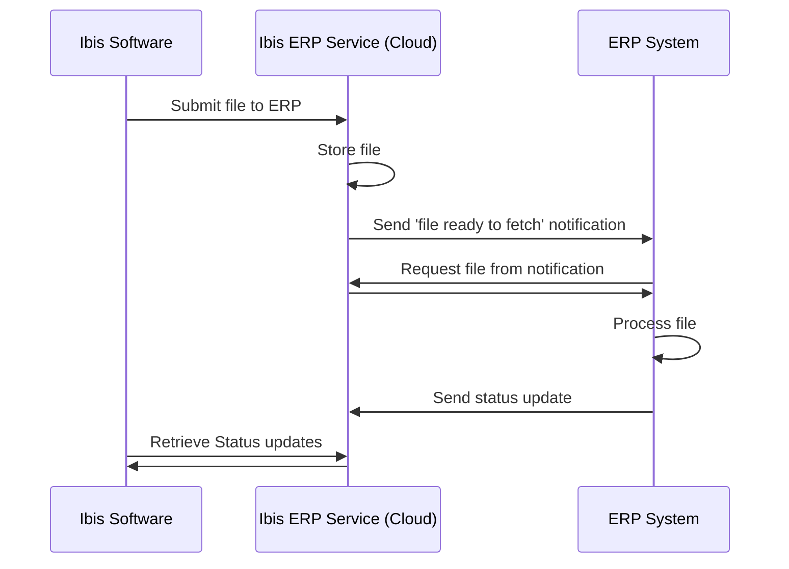

# Ibis ERP Integration

Brink Software has developed an API to integrate the calculation software with ERP systems. When a TradXML datafile is targeted for export to an ERP system, the calculation software sends a notification to the ERP system using a webhook. The notification contains a URL to the datafile and a token to access the file. The ERP system can then request the file from the calculation software using the URL and token.

## Process overview

The customer configures one or more ERP integrations in the Mijn Ibis environment. An ERP integration consists of a name and a url that is used to post the notification to, and optionally some data used to authenticate against the ERP system webhook url.

The customer can then export a file to the Ibis ERP Service using the Ibis calculation software. The Ibis ERP Service then sends a notification to the ERP system with a URL to the file and a token to access the file. The ERP system can then request the file from the calculation software using the URL and token. The ERP system processes the file and does whatever it needs to do with it. When the processing is done, the ERP system sends a status update to the Ibis ERP Service regarding the processed status. 
In the Ibis calculation software, the user can independently see the status updates of the file.



When the user submits the file and the ERP system needs additional data, the user is presented with a form to fill in the data. This data is included in the notification sent to the ERP system using the `customProperties` object.

## Authentication

The Ibis ERP Service supports OAuth authentication against the web hook url provided by the ERP system.

When the ERP System requests the file from the notification it needs to send a Brink Software provided Api Key to authenticate against the Ibis ERP Service.

## Notification example

```json
{ 
  "fileId": "74dedef3-6f2b-4a3...",
  "fileVersion": "2022-02-08T08:51:45.9211020Z",
  "applicationName": "calculerenvoorbouw",
  "dataUrl": "https://dataservice.ibis.nl/public/applications/calculerenvoorbouw/files/1e45-65gt-5656?version=2022-02-08T08:51:45.9211020Z", 
  "token": "eyJhbGciOiJSUzI1NiIsInR5cCI6IkpX...",
  "customProperties": {
    "projectId": "12345",
    "projectName": "Project X"
  }
}
```

The same file, identified by the `fileId` can be exported multiple times. Versions are timestamped using the field `fileVersion`. The `dataUrl` is the URL to the file and the `token` is the token to access the file. The `customProperties` object contains additional mandatory or optional data that the ERP system needs to process the file.

### TradXML

The file linked to in a notification is an XML file containing metadata and a TradXML document. An example file can be found [here](Files/demo.xml?raw=1) and a description of TradXML can be found [here](Files/TradXML1-3.pdf?raw=1). 

## Test the integration

We have created a sample webapplication that acts as an ERP system to demonstrate the integration. The application is located [here](https://web-erpdemo-prod.azurewebsites.net/). The application has a simple interface to receive notifications and fetch files.

> [!IMPORTANT]  
> The following steps need an Api Key to make calls to the Ibis ERP Service. Contact Brink Software to get an Api Key. There is one Api Key per integrator, not per customer.

> [!WARNING]  
> The Api Key is subject to change. In case of misuse or leaked Api Keys Brink Software will change to Api Key so make sure it is configurable. The Api Key is a secret shared between Brink Software and the 3rd party providing the ERP Service. Shared customers should not have access to this Api Key. 

1. To get started, get your subscription API key and paste it in the box "API key".
2. To trigger a notification use the following powershell command that creates a POST request to the Ibis ERP service. It needs the Api Key to authenticate the request using the `Ocp-Apim-Subscription-Key` header.

```powershell
$ibisErpServiceUri = 'https://dataservice.ibis.nl/public/notification'
$erpAppWebhookUri = 'https://web-erpdemo-prod.azurewebsites.net/notifications'
$headers = @{
    'Ocp-Apim-Subscription-Key' = '<Api Key goes here>'
}

Invoke-RestMethod -Uri $ibisErpServiceUri  -Body "{`"url`": `"${erpAppWebhookUri}`", `"customProperties`": { `"key`" : `"value`" }}" -ContentType "application/json" -Method Post -Headers $headers
```

3. The webapplication will receive the notification and display it in the interface.
4. Press the "Bestanden Ophalen" button which appears under the notification object.
5. See the retrieved file under the column "Bestand".
6. If desired, the file can be requested as Json if the checkbox "Haal bestand op als JSON" is checked.

### Request the file

To request the file from the Ibis Erp Service you can use the powershell command below. Take the value of `dataUrl` from the notification as url and use the `token` value as bearer token in the `Authorization` header. The `Ocp-Apim-Subscription-Key` header is used to authenticate the request to the Ibis Erp Service. :

```powershell
$dataUrl = 'https://dataservice.ibis.nl/public/applications/demoerp/files/8dd5a784-cd09-4068-8c7c-efdeabe95ac3?version=2022-02-16T11:12:56.3052287Z'
$headers = @{
    'Ocp-Apim-Subscription-Key' = '<Api Key goes here>'
    'Authorization' = 'Bearer <Token goes here>'
}

Invoke-RestMethod -Uri $dataUrl  -ContentType "application/json" -Method Get -Headers $headers -OutFile file.xml
```

### Update the status of the file

To update the status of the file you can use the powershell command below. The `dataUrl` field of the notification object is the endpoint base url, combined with status. The `status` is the status of the file. The `Ocp-Apim-Subscription-Key` header is used to authenticate the request to the Ibis Erp Service.
In example, if the `dataUrl` if the notification is `https://dataservice.ibis.nl/public/applications/demoerp/files/8dd5a784-cd09-4068-8c7c-efdeabe95ac3?version=2022-02-16T11:12:56.3052287Z` and the status is `Succeeded` the powershell command would be as follows:

```powershell
$ibisErpServiceUri = 'https://dataservice.ibis.nl/public/applications/demoerp/files/8dd5a784-cd09-4068-8c7c-efdeabe95ac3/status?version=2022-02-16T11:12:56.3052287Z'
$headers = @{
    'Ocp-Apim-Subscription-Key' = '<Api Key goes here>'
    'Authorization' = 'Bearer <Token goes here>'
}
Invoke-RestMethod -Uri $ibisErpServiceUri  -Body "{`"processedStatus`": `"Succeeded`", `"comments`" : `"some comment`"  }" -ContentType "application/json" -Method Post -Headers $headers
```
Currently, the enum values for the `processedStatus` are `Succeeded`, `Failed`. the `comments` field is optional.

[!WARNING]
Do note that this is a `POST` call. This call **will fail** when trying to add multiple statuses to the __same__ `version`
